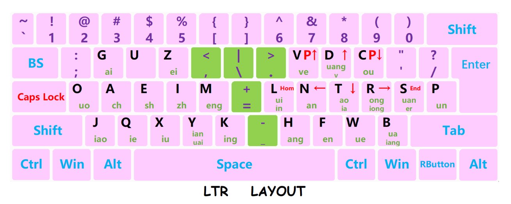

# ltr
ltr是一种新型的键盘布局,是根据的workman,programmer-dvorak得到的灵感,充分吸收了workman的人体工程学原理,和programmer-dvorak的符号优化.
同时,ltr在保证英文高效输入的前提下设计了汉语拼音专属的双拼方案.(这里只提供linux的实现方案,windows可以修改注册表和autohotkey脚本语言实现)
## 布局预览

## 实现键位布局
1. 复制99-ltr.hwdb到/etc/udev/hwdb.d
2. $ sudo udevadm hwdb --update
3. $ sudo udevadm trigger
## 实现热键
